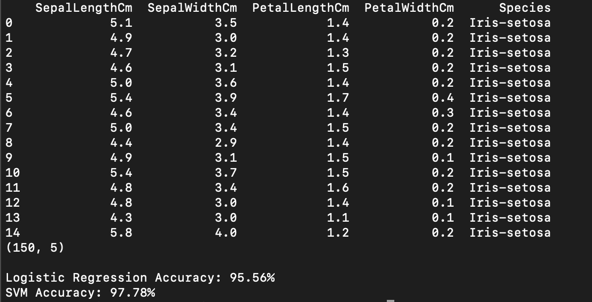
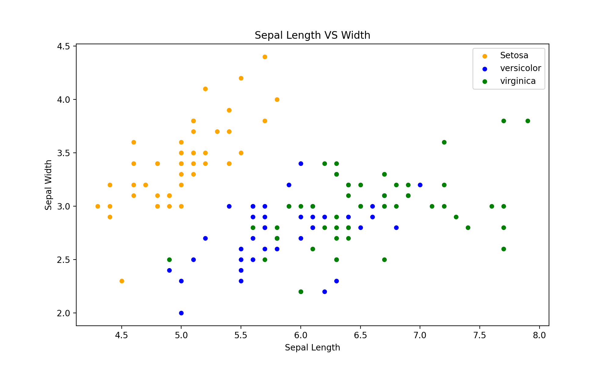
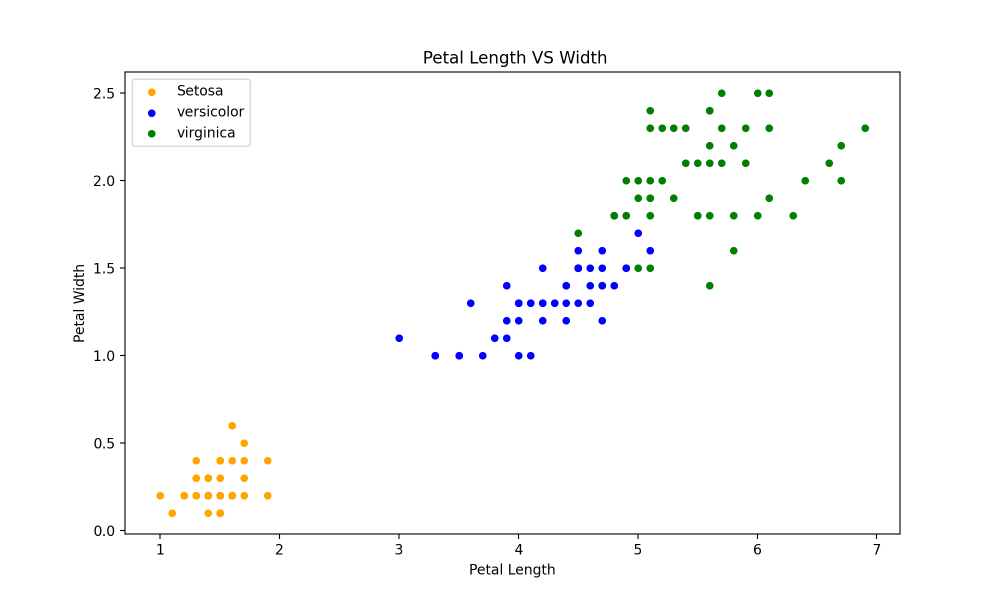
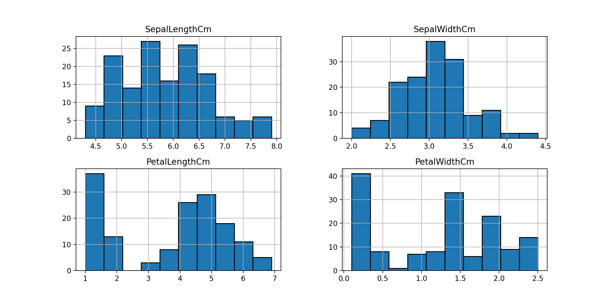

# IRIS-Dataset

## What is the IRIS Dataset?
The IRIS data set contains 3 classes of 50 instances each, where each class refers to a type of iris plant. One class is linearly separable from the other 2; the latter are NOT linearly separable from each other. 

The details on the dataset can be found [here](https://archive.ics.uci.edu/ml/datasets/iris)

# Result



# Installation

Download the project or the [run.py](https://github.com/blessinvarkey/IRIS-Dataset/blob/main/run.py) file along with a code editor.

Use the terminal to navigate to the source folder. 

Create a virtual environment using `conda` for easier management of dependencies and packages. You can also follow the instructions on the [official conda website](https://docs.conda.io/projects/conda/en/latest/user-guide/install/)

```
conda create --name codecarbon python=3.6
conda activate codecarbon
```

#### Install from PyPI repository
```
pip install codecarbon
```

#### Install from Conda repository

```
conda install -c codecarbon -c conda-forge codecarbon
```

This project requires **Python** and the following Python libraries installed:

- [NumPy](http://www.numpy.org/)
- [Pandas](http://pandas.pydata.org/)
- [matplotlib](http://matplotlib.org/)
- [scikit-learn](http://scikit-learn.org/stable/)

You can install them using 

```
pip install <write the packagename you want to download>
```

To run the code
```
python run.py
```


### Sepal Length vs Width & Petal Length vs Width
|||
| ------------- | ------------- |

### Sepal Length & Petal Length
||
| ------------- | 


[↑ Back to top](https://github.com/blessinvarkey/IRIS-Dataset#iris-dataset)
