# Energy Consumption in Machine Learning & Deep Learning Models 

The exploratory project estimates and measures carbon emissions from various Machine Learning and deep learning datasets to quantify and analyze their impact.

<br/>
- [About](https://github.com/blessinvarkey/EcoCoding#about)
- [Emissions](https://github.com/blessinvarkey/EcoCoding#emissions)
- [Installation](https://github.com/blessinvarkey/Energy-Consumption-In-Machine-Learning/blob/main/README.md#installation)
- [IRIS-Dataset](https://github.com/blessinvarkey/Estimation-of-Energy-Consumption-In-Machine-Learning/blob/main/README.md#1-iris-dataset)
- [ASD-Screening](https://github.com/blessinvarkey/Estimation-of-Energy-Consumption-In-Machine-Learning/blob/main/README.md#2-autism-spectrum-quotient-aq-10--q-chat)
- [Fashion MNIST](https://github.com/blessinvarkey/EcoCoding#3-fashion-mnist)

# About the project

- A 200g ebook requires about 15kg of raw materials (e.g. rare earth metal) 300L water, and 170 kg of CO2. Ecologically more beneficial than paperback only if you read between 30-60 books
- Energy consumption of ICT

__Email:__ 
- 1 MB Email =≈ 20g of CO2
- 20 emails on 365 days = car travelling 1000 km

__Web search:__
- ≈3.5 Wh, ≈ 1g CO2 equivalent
- 2-3 web searches per day =≈ 10 kg of CO2 per year

Per capita consumption: equivalent to ≈ 1,400 km by car 

__ICT global demand__
- 1% to 10%
- 2% of global emissions, equal to aviation industry from fuel

__Forecast:__
- Data centres could consume 28% of total energy consumption (est.: 11%, best 4%)
- “In worst-case scenario, ICT electricity usage could contribute upto 23% of the globally released greenhouse gas emissions in 2030”


The projects in the repo uses code carbon taking into account the computing infrastructure, location, usage and running time.


# Emissions


| Algorithm | Dataset/ Link to code | Instance | Accuracy| Emissions Recorded in Joules* (average) |Emissions Recorded in kg* (average) |
| ------------- |------------- | ------------- | ------------- | ------------- | ------------- |
|Logistic Regression | [IRIS Dataset](https://github.com/blessinvarkey/EcoCoding/blob/main/iris-dataset/train.py)|50 | 95.56%|11322593948.720951 joules|1.2598084791716727e-07 kg |
| Logistic Regression | [ASD Screening](https://github.com/blessinvarkey/EcoCoding/blob/main/asd-dataset/train.py)  | 761  | 99.53% | 23098647146.30177 joules | 2.570071104209542e-07 kg | 
|Support Vector Machines | [IRIS Dataset](https://github.com/blessinvarkey/EcoCoding/blob/main/iris-dataset/train.py)| 50 | 97.78%|11020140817.496267 joules|1.226156029830599e-07 kg|
|K Nearest Neighbors | [IRIS Dataset](https://github.com/blessinvarkey/EcoCoding/blob/main/iris-dataset/train.py)| 50 | 93.33%|11183853335.19536 joules|1.2443715040300566e-07 kg |
| Adam Optimization | [Fashion MNIST](https://github.com/blessinvarkey/EcoCoding/blob/main/fashion-mnist/train.py)  | 70,000 | |52381696453822.83 joules (5 epochs)| |  

# Installation

Download the project along with a code editor.

Use the terminal to navigate to the source folder. 

Create a virtual environment using `conda` for easier management of dependencies and packages. You can also follow the instructions on the [official conda website](https://docs.conda.io/projects/conda/en/latest/user-guide/install/)

```
conda create --name codecarbon python=3.6
conda activate codecarbon
```

#### Install from PyPI repository
```
pip install codecarbon
```

#### Install from Conda repository

```
conda install -c codecarbon -c conda-forge codecarbon
```

This project requires **Python** and some of the following Python libraries installed:

- [NumPy](http://www.numpy.org/)
- [Pandas](http://pandas.pydata.org/)
- [matplotlib](http://matplotlib.org/)
- [scikit-learn](http://scikit-learn.org/stable/)
- [tensorflow](https://www.tensorflow.org)

You can install them using 

```
pip install <packagename>
```

To run the code
```
python train.py
```

# About the Dataset 

## 1. Iris Dataset
The IRIS data set contains 3 classes of 50 instances each, where each class refers to a type of iris plant. One class is linearly separable from the other 2; the latter are NOT linearly separable from each other. 

The details on the dataset can be found [here](https://archive.ics.uci.edu/ml/datasets/iris)


### Data Visualization: Sepal Length vs Width & Petal Length vs Width
||||
| ------------- | ------------- |------------- |


## 2. ASD Screening
The Autism-Spectrum Quotient publisehed by Baron-Cohen, Wheelwright, Skinner, Martin, & Clubley was developed to assess how adults with 'normal' intelligence has the traits associated with autism spectrum conditions. Each question allows the subject to indicate "Definitely agree", "Slightly agree", "Slightly disagree" or "Definitely disagree". Approximately half the questions are worded to elicit an "agree" response from normal individuals, and half to elicit a "disagree" response. The subject scores one point for each question which is answered "autistically" either slightly or definitely." The questions cover five different domains associated with the autism spectrum: social skills; communication skills; imagination; attention to detail; and attention switching/tolerance of change.

According to the dataset, 'Yes' indicates that the individual is on the Autism Spectum and 'No' is indicated when the final score is less than or equal to 7. You can refer the questions from [here](https://www.nice.org.uk/guidance/cg142/resources/autism-spectrum-quotient-aq10-test-pdf-186582493).

The Dataset can be downloaded from the UCI Repository which is publicly available [here](https://archive.ics.uci.edu/ml/datasets/Autism+Screening+Adult). 

### Data Visualization
|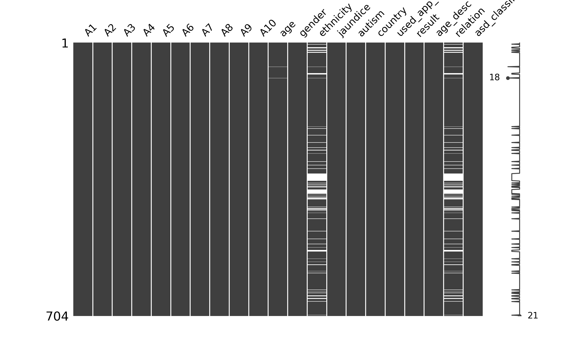|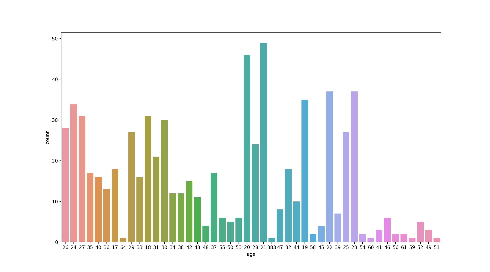|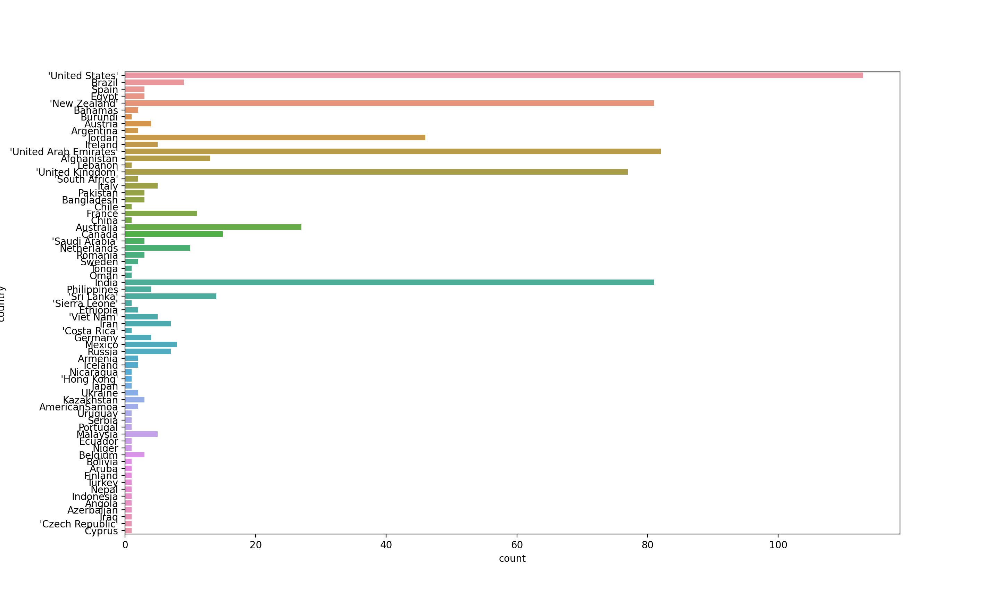|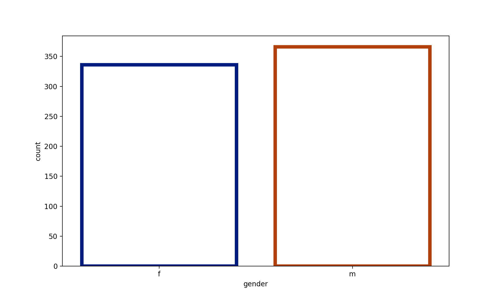|
| ------------- | ------------- |------------- | ------------- | 
|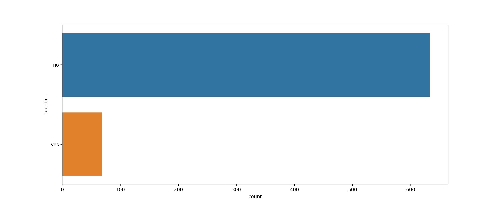|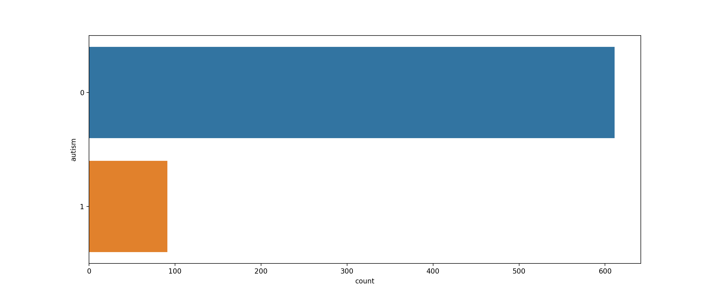|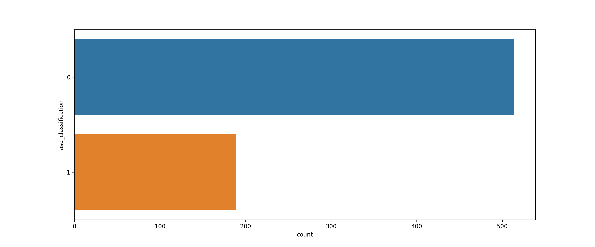|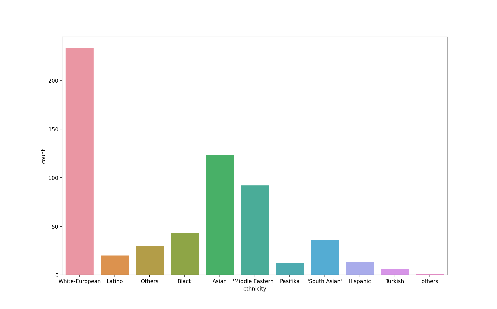|

|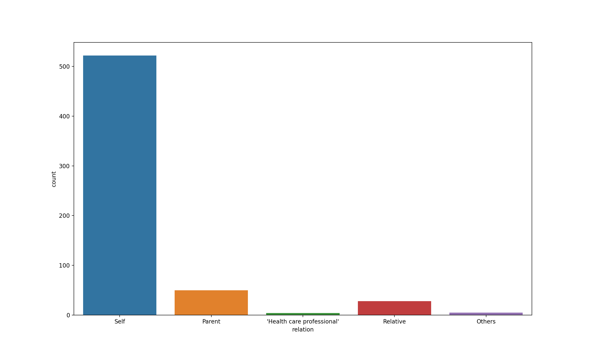|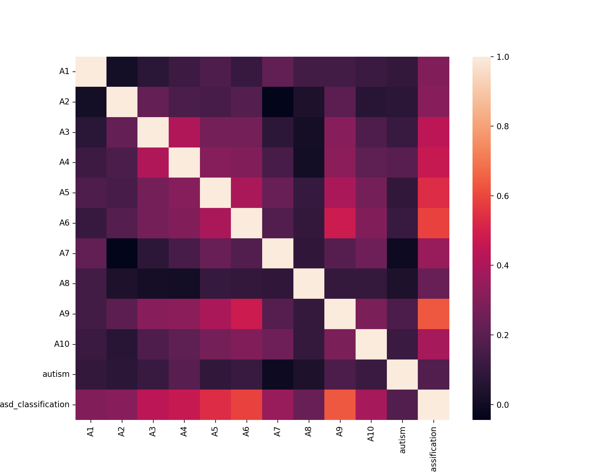|
| ------------- |------------- | 


## 3. Fashion MNIST
Fashion MNIST is a dataset comprised of 60,000 small square 28×28 pixel grayscale images of items of 10 types of clothing, such as shoes, t-shirts, dresses, and more. The mapping of all 0-9 integers to class labels is listed below.

0: T-shirt/top  
1: Trouser  
2: Pullover   
3: Dress   
4: Coat   
5: Sandal   
6: Shirt   
7: Sneaker   
8: Bag   
9: Ankle boot    

### Data Visualization
||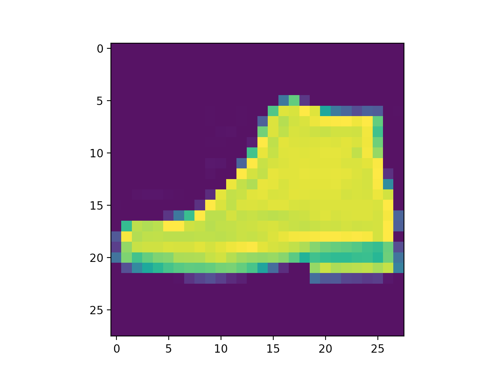|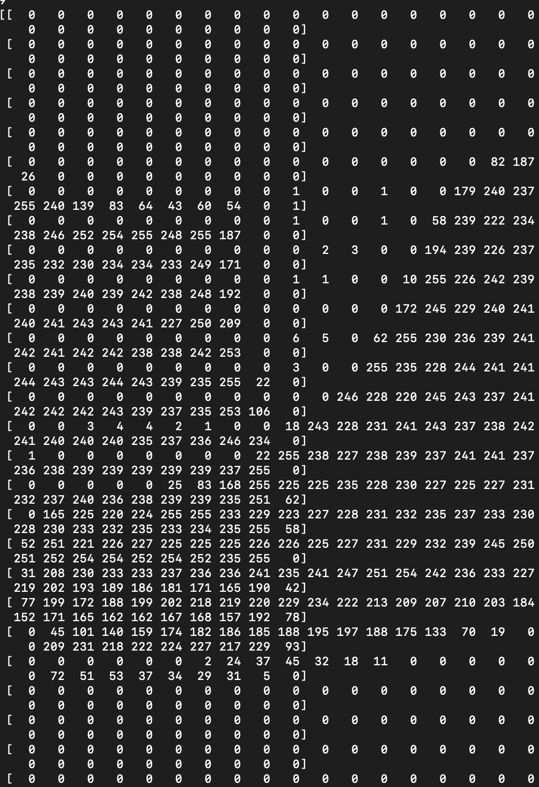|
|--|--|--|
 

[↑ Back to top](https://github.com/blessinvarkey/EcoCoding#energy-consumption-in-machine-learning--deep-learning-models)
